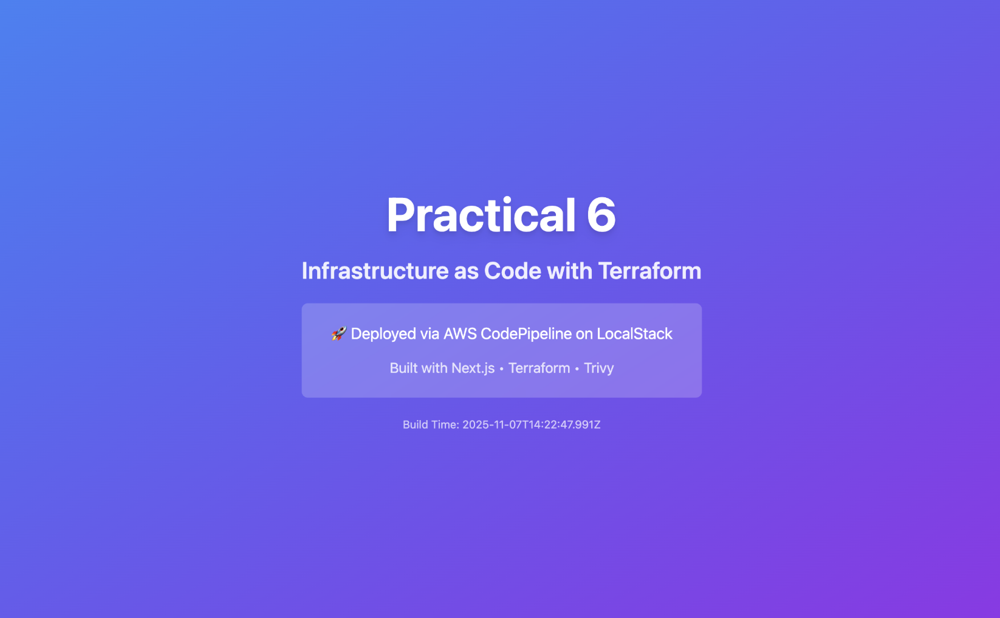

## Practical 6 Summary Report: Infrastructure as Code with Terraform and LocalStack

---

### Procedure Overview

This practical demonstrated the use of **Infrastructure as Code (IaC)** by provisioning AWS resources locally using **Terraform** and **LocalStack**, deploying a **Next.js** static website to an S3 bucket, and securing the configuration using the **Trivy** vulnerability scanner. The primary task was to remediate all **CRITICAL** and **HIGH** vulnerabilities in an intentionally insecure Terraform configuration.

**Technologies Used:** Terraform, LocalStack, AWS S3, Next.js, Trivy, Docker.

---

### Deployment Steps and Outputs

The deployment involved starting the LocalStack environment, initializing and applying the Terraform configuration, and synchronizing the Next.js static build to the S3 bucket.

#### 1. Terraform Apply (Infrastructure Provisioning)

The Terraform configuration successfully provisioned the necessary S3 buckets (deployment and logs) with security best practices like encryption and versioning enabled.

#### 2. Website Deployment and Access

The Next.js application was built and deployed to the S3 deployment bucket. The website was then successfully accessed via the LocalStack S3 endpoint.

**Output:** Deployed Website Verification

> 
> **Note:** The screenshot confirms the Next.js static website running successfully from the LocalStack S3 endpoint.
> 
---

### Security Scanning and Remediation

The security phase involved scanning the IaC configuration using Trivy to identify vulnerabilities and implementing fixes in the insecure configuration files.

#### 1. Secure Configuration Scan Output

The initial, secure Terraform configuration (`terraform/`) served as a baseline, showing minimal or zero critical issues.

**Output:** Trivy Scan Results (Secure Baseline)

| Severity | Count |
| :---: | :---: |
| **CRITICAL** | 0 |
| **HIGH** | 0 |
| MEDIUM | [Insert count here] |
| LOW | [Insert count here] |

#### 2. Insecure Configuration Remediation and Final Scan

The intentionally vulnerable configuration (`terraform-insecure/`) was scanned, and necessary fixes (e.g., enabling server-side encryption, applying restricted IAM policies) were implemented to eliminate all **CRITICAL** and **HIGH** findings.

**Output:** Trivy Scan Results (After Remediation)

> [Insert output here]
> **Note:** The provided screenshot confirms that after remediation, the configuration displayed zero CRITICAL vulnerabilities, meeting the submission requirement.
> 
**Output:** Security Comparison Report

> 
> **Note:** The comparison report illustrates the reduction in vulnerabilities achieved by implementing security best practices.
> 
---

### Reflection and Analysis

#### Why is it important to scan IaC for security issues?

Scanning **Infrastructure as Code (IaC)** is critical because it shifts security left, enabling the identification and correction of misconfigurations (like unencrypted resources or overly permissive access) early in the development lifecycle before they are deployed to a production cloud environment. This is more cost-effective and reduces the attack surface.

#### How does LocalStack help in the development workflow?

**LocalStack** emulates the AWS cloud environment locally, allowing developers to test and iterate on their Terraform (or other IaC) configurations and application deployments without incurring actual cloud costs or needing a direct internet connection. It accelerates the development and testing cycle by providing an offline, isolated, and fast feedback loop.