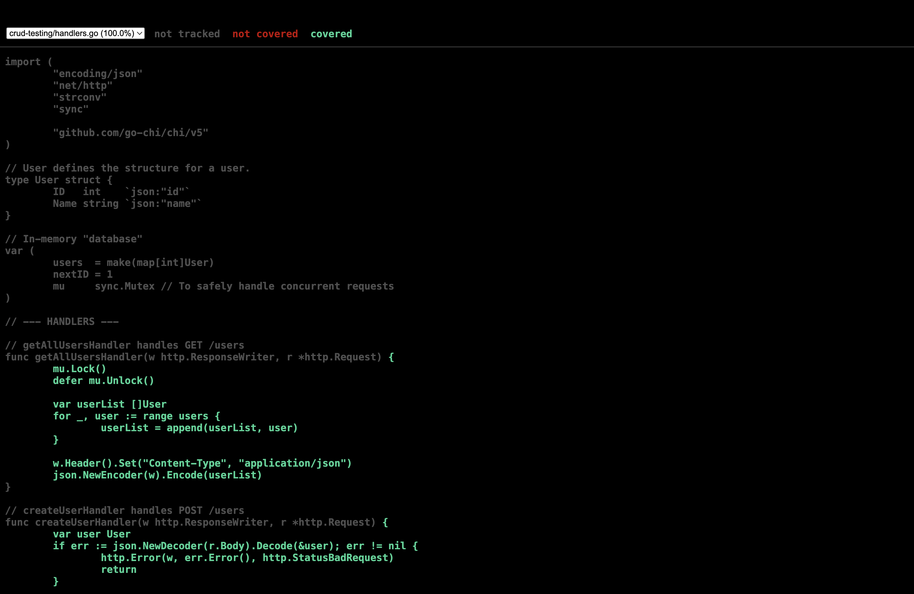

# Practical 2 Report: Software Testing and Quality Assurance

-----

## Objective and Scope

The objective of this practical was to implement robust **unit tests** for a simple Go HTTP server and measure the resulting **code coverage**. The system under test was an in-memory "Users" API designed to handle common CRUD (Create, Read, Update, Delete) operations. The procedure exclusively utilized the Go standard library, specifically the `testing` and `net/http/httptest` packages, to ensure code reliability.

-----

## Unit Testing Procedure

Unit tests were written to simulate the behavior of external clients, verifying server functionality without starting a live network listener.

1.  **Request Construction:** The `httptest.NewRequest` function was used to construct mock HTTP requests (e.g., `POST` for Create, `GET` for Read), including setting headers and request bodies.
2.  **Response Recording:** A `httptest.NewRecorder` was initialized to capture the server's output, including the HTTP status code, response headers, and the response body.
3.  **Handler Execution:** The server's HTTP handler function was called directly, passing the mock request and the recorder.
4.  **Assertion:** The test function asserted that the recorder's status code and the recorded JSON response body matched the expected values for success and error conditions.

-----

## Code Coverage Measurement

Code coverage was measured to quantify the proportion of source code executed by the test suite, ensuring critical logic was verified.

**1. Coverage Summary Execution:**

The following command was used to execute tests and print the coverage percentage:

```bash
go test ./... -v -cover
```

**Output:**


**2. Visual Coverage Report Generation:**

To identify untested lines of code, a visual HTML report was generated in two steps:

a. Profile creation:

```bash
go test -coverprofile=coverage.out
```

b. HTML report generation:

```bash
go tool cover -html=coverage.out
```



This command automatically opened a browser-based report. Within the report, lines of code executed by the tests were highlighted in **green**, while untested sections (often error paths or edge cases) were highlighted in **red**, providing actionable feedback for quality improvement.
