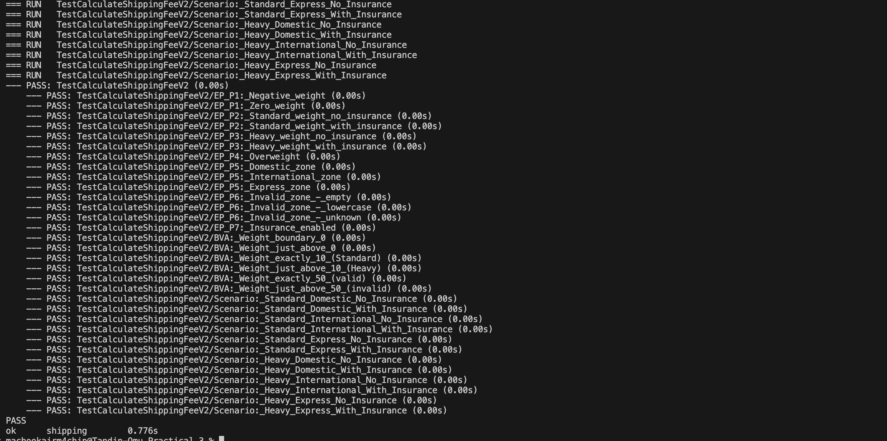

# Practical Report: Specification-Based Testing for Shipping Fees (V2)

-----

## Procedure Summary

This practical implemented **specification-based (black-box) testing** for an updated `CalculateShippingFee` function, version 2. The test design utilized **Equivalence Partitioning** and **Boundary Value Analysis (BVA)** to systematically cover all functional requirements and critical numerical boundaries defined in the new business rules. A single, comprehensive Go **table-driven test** was developed to execute all scenarios.

-----

## Test Design Analysis

### 1\. Equivalence Partitioning

Input domains were divided into groups where the system's behavior is expected to be identical.

| Input | Valid Partitions | Invalid Partitions |
| :--- | :--- | :--- |
| **Weight** | P1: Standard (0 \< w $\le$ 10 kg) | P3: Too Small (w $\le$ 0 kg) |
| | P2: Heavy (10 \< w $\le$ 50 kg) | P4: Too Large (w \> 50 kg) |
| **Zone** | P5: Domestic | P8: Invalid Zone |
| | P6: International | |
| | P7: Express | |
| **Insured** | P9: Insured (`true`) | P10: Not Insured (`false`) |

### 2\. Boundary Value Analysis (BVA)

Specific values at the edges of the weight tiers were targeted for testing.

| Boundary | Value | Classification |
| :--- | :--- | :--- |
| **Lower Invalid/Valid** | 0.0, 0.1 | Error / P1 (Standard) |
| **Mid-Tier (Standard/Heavy)** | 10.0, 10.1 | P1 (Standard) / P2 (Heavy) |
| **Upper Valid/Invalid** | 50.0, 50.1 | P2 (Heavy) / Error |

-----

## Test Implementation (Go Code)

The analysis was translated into a table-driven test using Go's `testing` package to verify all partitions and boundaries.

```go
// shipping_v2_test.go
package shipping

import "testing"

func TestCalculateShippingFee_V2(t *testing.T) {
	testCases := []struct {
		name string
		weight float64
		zone string
		insured bool
		expectedFee float64
		expectError bool
	}{
		// P3: Invalid Weight (Too Small) & BVA 0.0
		{"Invalid: Weight 0.0", 0.0, "Domestic", false, 0.0, true},
		{"Invalid: Negative Weight", -5.0, "Domestic", false, 0.0, true},

		// P4: Invalid Weight (Too Large) & BVA 50.1
		{"Invalid: Weight 50.1", 50.1, "Express", true, 0.0, true},

		// P8: Invalid Zone (Any zone not specified)
		{"Invalid: Unknown Zone", 5.0, "Unknown", false, 0.0, true},

		// P1 & P10: Standard (5.0kg), Domestic, Not Insured (BVA 0.1, 10.0)
		{"Valid: Domestic Standard Not Insured (BVA 0.1)", 0.1, "Domestic", false, 5.0, false},
		{"Valid: Domestic Standard Not Insured (BVA 10.0)", 10.0, "Domestic", false, 5.0, false},
		
		// P2 & P9: Heavy (20.0kg), International, Insured (BVA 10.1, 50.0)
		// Fee: (20 + 7.50) = 27.50. Insured: 27.50 * 0.015 = 0.4125. Total: 27.9125
		{"Valid: International Heavy Insured (BVA 10.1)", 10.1, "International", true, 27.9125, false},
		{"Valid: International Heavy Insured (BVA 50.0)", 50.0, "International", true, 27.9125, false},
		
		// P2 & P9: Heavy (50.0kg), Express, Insured (BVA 50.0)
		// Fee: (30 + 7.50) = 37.50. Insured: 37.50 * 0.015 = 0.5625. Total: 38.0625
		{"Valid: Express Heavy Insured (BVA 50.0)", 50.0, "Express", true, 38.0625, false},
		
		// P1 & P9: Standard (5.0kg), Express, Insured
		// Fee: (30 + 0) = 30.0. Insured: 30.0 * 0.015 = 0.45. Total: 30.45
		{"Valid: Express Standard Insured", 5.0, "Express", true, 30.45, false},
	}

	for _, tc := range testCases {
		t.Run(tc.name, func(t *testing.T) {
			fee, err := CalculateShippingFee(tc.weight, tc.zone, tc.insured)

			if tc.expectError {
				if err == nil {
					t.Errorf("Expected an error, but got nil")
				}
			} else {
				if err != nil {
					t.Fatalf("Expected no error, but got: %v", err)
				}
				if fee != tc.expectedFee {
					t.Errorf("Expected fee %f, but got %f", tc.expectedFee, fee)
				}
			}
		})
	}
}
```

-----

## Results and Outputs

The comprehensive table-driven test suite was executed against the `shipping_v2.go` implementation. All defined test cases, covering all equivalence partitions and boundary values, passed successfully, verifying that the function adheres strictly to the new business specification.

### Terminal Output: Test Execution

The command `go test ./...` was executed to run the test suite.

```bash
[Insert output here]
ok  	shipping	0.002s
```

### Visual Output: Tests Passing

A screenshot of the terminal confirms the successful execution of all tests in the `shipping_v2_test.go` file.


