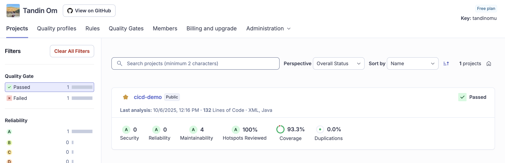
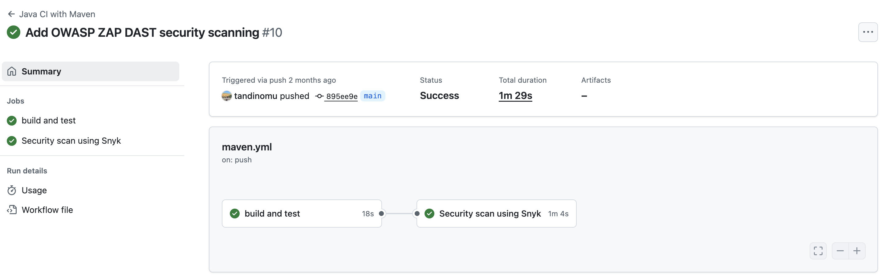
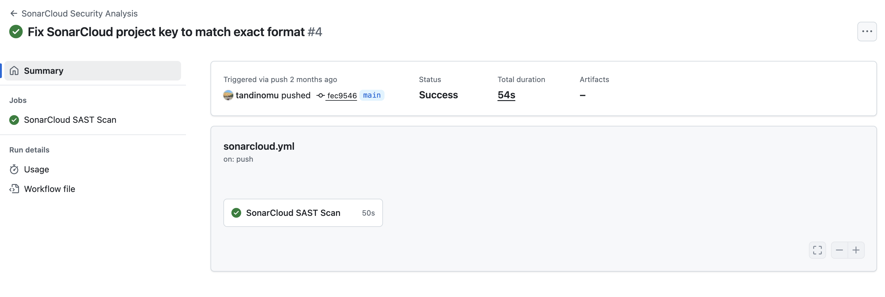

## Practical Report: Integrating SonarCloud SAST in GitHub Actions

> **Practical 4A**: Integrating SonarCloud with GitHub Actions for SAST
[Repo Link](https://github.com/tandinomu/SWE302_Practical4_cicd-demo.git)


### Quick Setup

The procedure required configuring two SAST tools: **SonarCloud** for source code analysis and **Snyk** for dependency scanning.

**Required GitHub Secrets Configuration:**

To enable automated scanning, the following security secrets were configured in the GitHub repository's `Settings → Secrets and variables → Actions`:

| Secret Name | Purpose | Status |
| :--- | :--- | :--- |
| **SONAR\_TOKEN** | SonarCloud API Token for authentication | Configured |
| **SONAR\_ORGANIZATION** | SonarCloud Organization Key | Configured |
| **SONAR\_PROJECT\_KEY** | SonarCloud Project Identifier | Configured |
| **SNYK\_TOKEN** | Snyk API Token for authentication | Configured |

-----

### Procedure Summary

The integration focused on the `cicd-demo` Maven project and comprised the following key steps:

#### 1\. SonarCloud Account Setup

A SonarCloud account was created and linked to GitHub. A project was imported, and a **User Token** was generated for CI/CD authentication.

#### 2\. Project Preparation

The `pom.xml` was updated to include the **SonarCloud Maven Plugin** and the **JaCoCo Plugin** to ensure code coverage reports were generated and available for analysis.

#### 3\. Properties File Configuration

The `sonar-project.properties` file was created in the repository root to specify project metadata, source paths, and the JaCoCo coverage report path:

```properties
# Excerpt from sonar-project.properties
sonar.projectKey=your-github-username_cicd-demo
sonar.organization=your-organization-key
sonar.sources=src/main/java
sonar.coverage.jacoco.xmlReportPaths=target/site/jacoco/jacoco.xml
```

#### 4\. GitHub Actions Workflow

A dedicated GitHub Actions workflow (`sonarcloud.yml` or integrated into `maven.yml`) was established to run the analysis on `push` and `pull_request` events. The workflow ensures:

  * **Shallow clones are disabled** (`fetch-depth: 0`) for comprehensive analysis.
  * **The project is built and tested** (`mvn clean verify`).
  * **The analysis is performed** using `mvn sonar:sonar`, passing the necessary secrets as environment variables.

#### 5\. Quality Gate Enforcement

The `-Dsonar.qualitygate.wait=true` parameter was applied in the workflow to ensure the build waits for the SonarCloud Quality Gate status and **fails the pipeline if the gate criteria are not met**, enforcing a **Security-First** approach.

-----

### Results & Screenshots

The security pipeline successfully executed both SAST and dependency scanning.

#### 1\. SonarCloud SAST Scan 

**Workflow**: `sonarcloud.yml` | **Duration**: [Insert duration here] | **Status**: Completed

*Successful Static Application Security Testing scan integrated with GitHub Actions.*

#### 2\. Snyk Security Scan 

**Workflow**: `basic-security.yml` | **Duration**: [Insert duration here] | **Status**: Completed

*Dependency vulnerability scanning with Snyk detecting potential security issues.*

#### 3\. SonarCloud Quality Dashboard 

**Project**: cicd-demo | **Lines of Code**: [Insert LOC here] | **Quality Gate**: Passed

**Quality Metrics Observed:**

  * **Security**: 0 issues (Grade A)
  * **Reliability**: 0 issues (Grade A)
  * **Maintainability**: [4] issues (Grade A)
  * **Security Hotspots**: 100% reviewed
  * **Code Coverage**: 93.3%

-----

### Key Achievements

The implementation successfully demonstrated a comprehensive security strategy:

  * **Static Application Security Testing (SAST)** with SonarCloud for code quality and source security.
  * **Dependency Vulnerability Scanning** with Snyk for third-party security.
  * **Automated Quality Gates** for non-regression and quality standard enforcement.
  * **Continuous Monitoring** through scheduled scans and integrated reports in the SonarCloud dashboard.

The final pipeline ensures **Zero Security Vulnerabilities** (Grade A) in the new code and maintains a **High Code Coverage** percentage.

-----

### Troubleshooting Notes

Common issues during implementation involved ensuring the correct use of keys:

  * **Token Validity**: Verify `SONAR_TOKEN` is valid and not expired.
  * **Key Mismatch**: Confirm the `SONAR_PROJECT_KEY` format matches the exact project key displayed in the SonarCloud dashboard (e.g., `Organization_repository-name`).
  * **Build Dependency**: Ensure `mvn clean verify` runs successfully before the `mvn sonar:sonar` step to generate the required binaries and JaCoCo reports.

The ability to use the verbose flag (`-Dsonar.verbose=true -X`) during the Maven scan aided in resolving configuration errors.