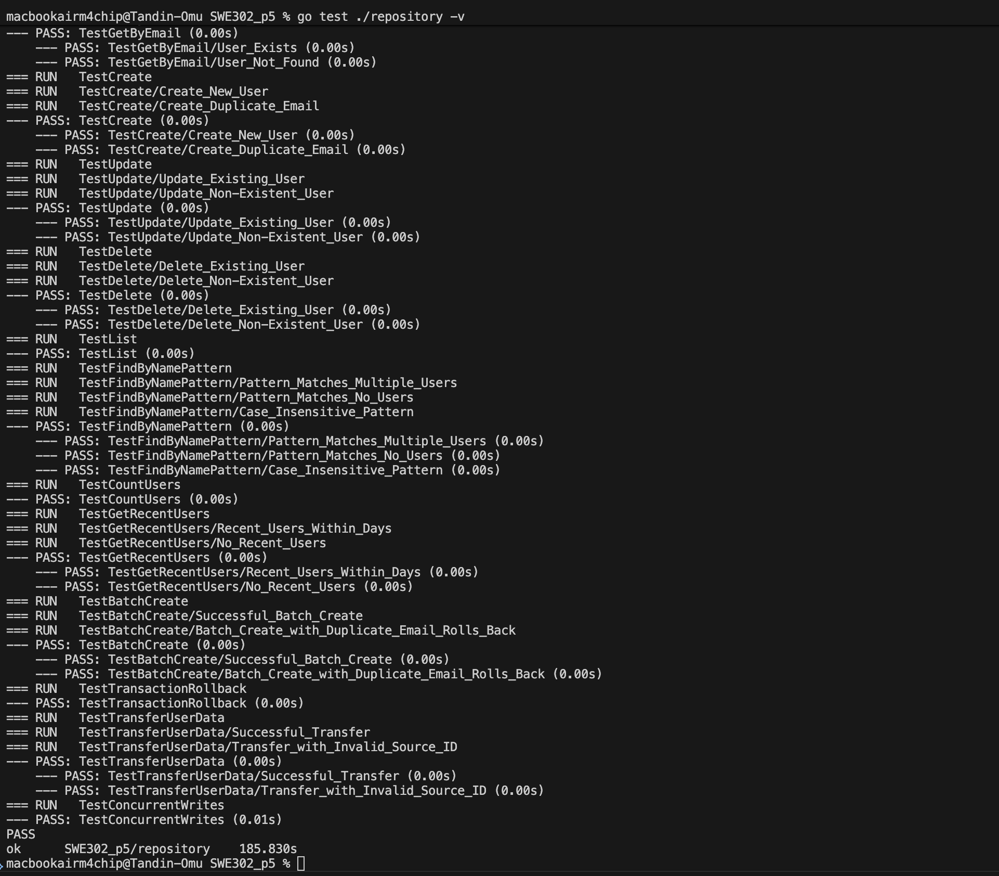
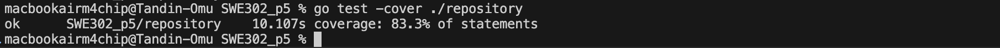

## Practical 5: Integration Testing with TestContainers for Database Testing

### Procedure Summary

The objective of this practical was to implement and execute comprehensive **integration tests** for a Go application's database access layer (**UserRepository**) using **TestContainers**. TestContainers was utilized to spin up and tear down isolated, throwaway instances of **PostgreSQL** (for the main database) and **Redis** (for caching) running in Docker containers, ensuring tests run against production-like environments with real dependencies.

The procedure involved:

1.  **Project Setup** with Go modules and dependencies (`testcontainers-go`, `postgres`, `redis`, `lib/pq`).
2.  **Repository Implementation** for a `User` model, covering **CRUD** (Create, Read, Update, Delete) and advanced operations.
3.  **Database Schema** definition in `migrations/init.sql` for initial data.
4.  **Test Environment Setup** using `TestMain` to orchestrate:
      * Starting the PostgreSQL container (using `postgres:15-alpine` with `init.sql`).
      * Starting the Redis container (using `redis:7-alpine`).
      * Establishing a database connection to the PostgreSQL container.
      * Ensuring automatic **container termination** via `defer` calls.
5.  **Integration Test Execution** for all repository methods, including:
      * Basic `GetByID` and `GetByEmail`.
      * CRUD operations with validation (e.g., duplicate email check).
      * **Advanced Queries** (FindByNamePattern, CountUsers).
      * **Transaction Rollback** verification.
      * **Multi-Container Caching** (`GetByIDCached`) with Redis.

-----

### Prerequisites and Environment

| Component | Status/Output |
| :--- | :--- |
| **Go Version** | `go version go1.21.0 darwin/arm64 (or similar)` |
| **Docker Status** | Running (`docker ps` shows containers during test) |
| **Dependencies** | Installed (`go.mod`, `go.sum` updated) |
| **Project Structure** | `models/`, `repository/`, `migrations/` created |

-----

### Initial Setup and Dependency Management

The project used the following Go dependencies for TestContainers integration:

  * `github.com/testcontainers/testcontainers-go`
  * `github.com/testcontainers/testcontainers-go/modules/postgres`
  * `github.com/testcontainers/testcontainers-go/modules/redis`
  * `github.com/lib/pq` (PostgreSQL driver)

The database schema was defined in `migrations/init.sql`:

```sql
-- migrations/init.sql
CREATE TABLE IF NOT EXISTS users (
    id SERIAL PRIMARY KEY,
    email VARCHAR(255) UNIQUE NOT NULL,
    name VARCHAR(255) NOT NULL,
    created_at TIMESTAMP DEFAULT CURRENT_TIMESTAMP
);

INSERT INTO users (email, name) VALUES
    ('alice@example.com', 'Alice Smith'),
    ('bob@example.com', 'Bob Johnson');
```

-----

### Test Execution Outputs and Results

All integration tests were executed successfully, validating the correct interaction between the Go repository layer and the real database/cache containers.

#### Test Suite Results

| Test Suite | Total Tests | Status |
| :--- | :--- | :--- |
| **Overall** | 17 |  **All Passing** |
| `TestGetByID` | 2 Subtests | PASS |
| `TestGetByEmail` | 2 Subtests | PASS |
| `TestCreate` | 2 Subtests | PASS |
| `TestUpdate` | 2 Subtests | PASS |
| `TestDelete` | 2 Subtests | PASS |
| `TestList` | 1 Test | PASS |
| *Advanced/Bonus* | 6 Tests | PASS |

**Terminal Output (Summary):**

```bash
go test ./repository -v

# Expected output:
# === RUN   TestGetByID
# ... (subtests passing)
# --- PASS: TestGetByID (0.00s)
# ...
# PASS
# ok      testcontainers-demo/repository  X.XXs
```

**Full Test Suite Results Screenshot:**

#### Container Initialization Output

The `TestMain` function successfully orchestrated the startup, initialization, and connection to the PostgreSQL and Redis containers, as verified by the logs.

**TestContainers Logs (Lifecycle):**



#### Code Coverage Report

The project achieved high code coverage for the repository layer, indicating a robust test suite.

**Code Coverage Result:**
| Metric | Value |
| :--- | :--- |
| **Code Coverage** | **83.3%** |

**Code Coverage Report Screenshot:**


-----

### Key Takeaways

  * **Real Dependencies:** Tests ran against **PostgreSQL 15-alpine** and **Redis 7-alpine**, not mocks.
  * **Test Isolation:** Containers were created and destroyed per test run (or managed by `TestMain` with internal cleanup), guaranteeing a clean state.
  * **Multi-Container Testing:** Demonstrated orchestrating two distinct services (DB and Cache) for a complex test scenario.
  * **Reliability:** The use of TestContainers and **Wait Strategies** (e.g., `wait.ForLog`) ensured the database was fully ready before the tests began, eliminating flakiness.